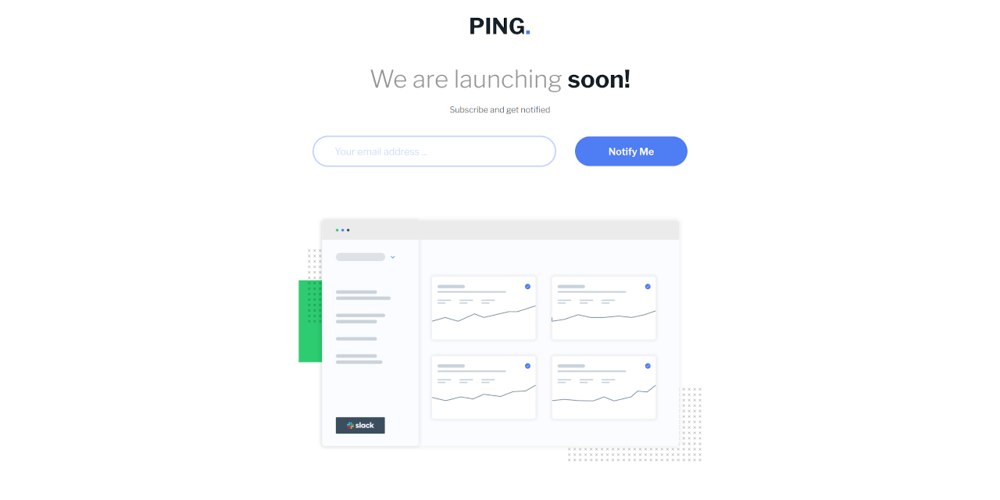
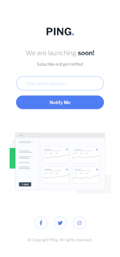

# Frontend Mentor - Ping coming soon page solution

This is a solution to the [Ping coming soon page challenge on Frontend Mentor](https://www.frontendmentor.io/challenges/ping-single-column-coming-soon-page-5cadd051fec04111f7b848da). Frontend Mentor challenges help you improve your coding skills by building realistic projects.

## Table of contents

- [Overview](#overview)
  - [The challenge](#the-challenge)
  - [Screenshot](#screenshot)
  - [Links](#links)
- [My process](#my-process)
  - [Built with](#built-with)
  - [What I learned](#what-i-learned)
  - [Useful resources](#useful-resources)
- [Author](#author)

## Overview

### The challenge

Users should be able to:

- View the optimal layout for the site depending on their device's screen size
- See hover states for all interactive elements on the page
- Submit their email address using an `input` field
- Receive an error message when the `form` is submitted if:
  - The `input` field is empty. The message for this error should say _"Whoops! It looks like you forgot to add your email"_
  - The email address is not formatted correctly (i.e. a correct email address should have this structure: `name@host.tld`). The message for this error should say _"Please provide a valid email address"_

### Screenshot

### Links

- Solution URL: [https://github.com/unkovicgit/ping-coming-soon-page](https://github.com/unkovicgit/ping-coming-soon-page)
- Live Site URL: [https://unkovicgit.github.io/ping-coming-soon-page](https://unkovicgit.github.io/ping-coming-soon-page)

## My process

### Built with

- Semantic HTML5 markup
- CSS custom properties
- Flexbox
- CSS Grid
- Mobile-first workflow
- New CSS Reset

### What I learned

I started using new CSS reset from [Elad Shechter](https://elad2412.github.io/the-new-css-reset/). I learned about it from reading [this CSS tricks article](https://css-tricks.com/an-interview-with-elad-shechter-on-the-new-css-reset). This CSS reset is built from the understanding we don’t want to use the default style we are getting from the browsers, except the ‘display’ property.

### Useful resources

- [CSS-Tricks](https://css-tricks.com/)
- [MDN Web Docs](https://developer.mozilla.org/en-US/)

## Author

- Website - [Unković Nemanja](https://github.com/unkovicgit/)
- Frontend Mentor - [@unkovicgit](https://www.frontendmentor.io/profile/unkovicgit)
- Twitter - [@nemanja_unkovic](https://twitter.com/nemanja_unkovic)
